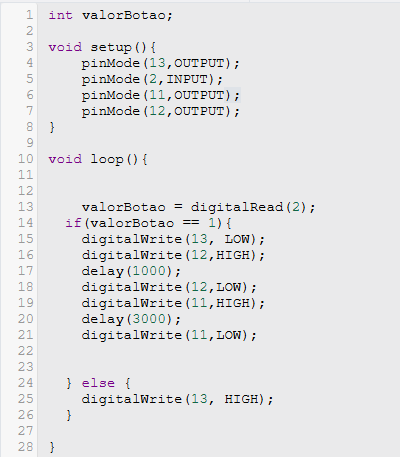

Nome: Guilherme Ribeiro Niza	2ºS Informática  
      Alefe Santiago  
      Derick de Freitas Prado  
      
# Projeto: Semáforo com Arduino  

## Descrição
Este projeto consiste em simular um semáforo de trânsito utilizando a plataforma Arduino. O semáforo é controlado por três LEDs (verde, amarelo e vermelho) e um botão que simula a troca de sinais. A troca de sinais ocorre a partir da interação com o botão, onde o semáforo muda as cores dos LEDs em um ciclo definido: verde → amarelo → vermelho → verde, reiniciando o ciclo.

## Componentes Utilizados:
+ **Arduino Uno**: Microcontrolador utilizado para controlar os LEDs e ler o estado do botão.
+ **3 LEDs (vermelho, amarelo e verde)**: LEDs que representam as luzes do semáforo.
+ **3 resistores de 220Ω**: Usados para limitar a corrente que passa pelos LEDs e evitar que queimem.
+ **1 botão**: Utilizado para simular a troca de sinal do semáforo.
+ **1 resistor de 10kΩ**: Usado no circuito de pull-down para garantir uma leitura estável do estado do botão.
+ **Fios jumper e protoboard**: Para fazer as conexões entre os componentes e o Arduino.

## Funcionamento do Semáforo:
+ Início: O LED verde começa aceso, indicando "siga".
+ Mudança de sinal: Quando o botão é pressionado, ocorre a seguinte sequência:
+ O LED verde apaga.
+ O LED amarelo acende por 1 segundo.
+ O LED amarelo apaga.
+ O LED vermelho acende por 3 segundos, indicando "pare".
+ O LED vermelho apaga e o LED verde acende novamente, reiniciando o ciclo.

## Código Arduino:

